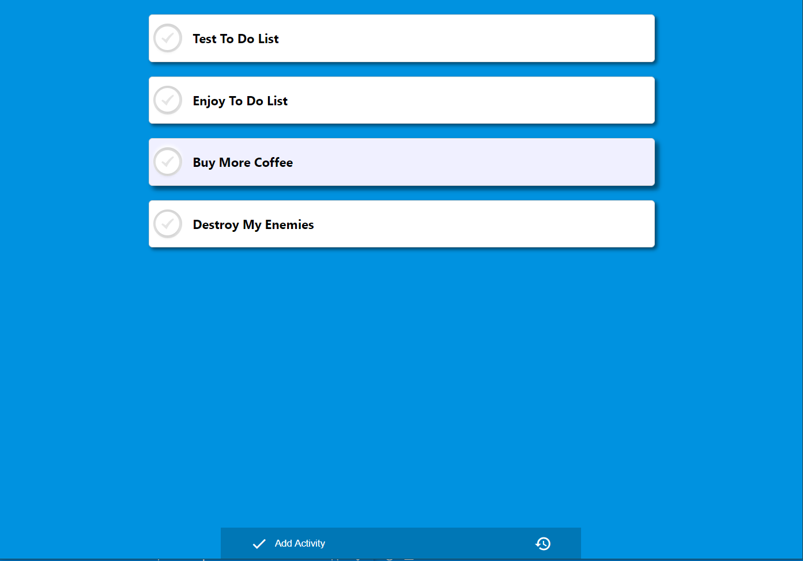
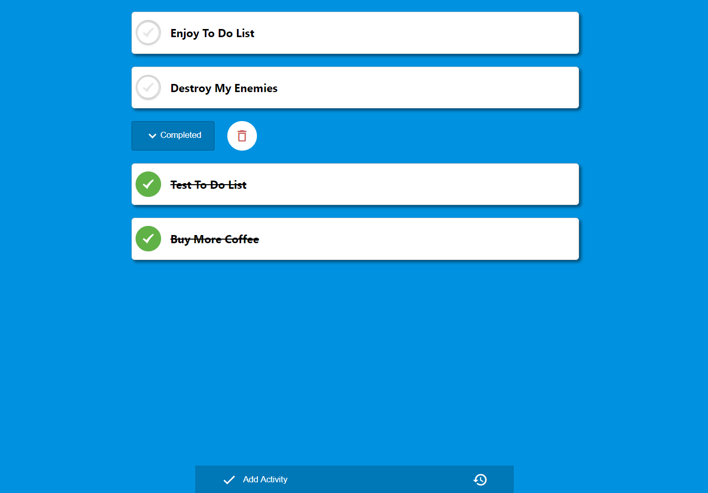
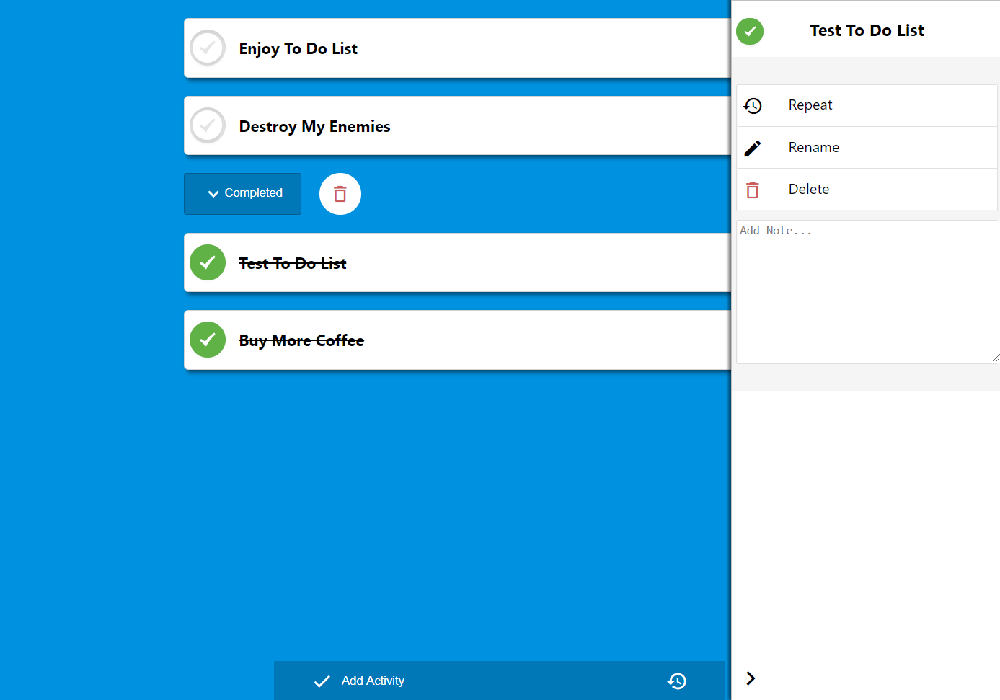
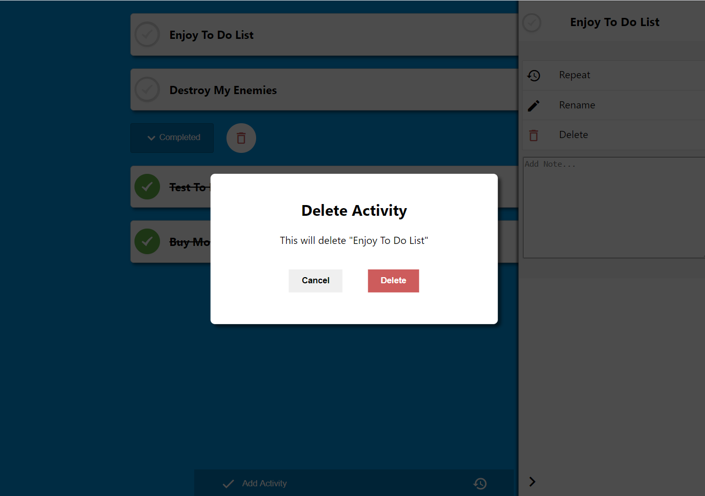

# simple-todo
A simple to-do list built using React Hooks.
In the project, I use Hooks instead of Redux to handle the state and dispatch functions. In the web app, it's possible to add a to-do item, mark it as completed, add a note to it, make it recurring. The current list is saved in local storage after every operation. 


## Live Demo
    <a href="https://simple-to-do-e1b08.web.app/">View Demo</a>


## Screenshots






## Built With

* React.js
* React Hooks

### Installation

1. Clone the repo
```sh
git clone https://github.com/MirkoWebDev/simple-todo.git
```
2. Install NPM packages
```sh
npm install
```

## To Do

* improve performance and avoid unnecessary rerenders
* add online storage
* add styling options for the user (colors, fonts, etc.)